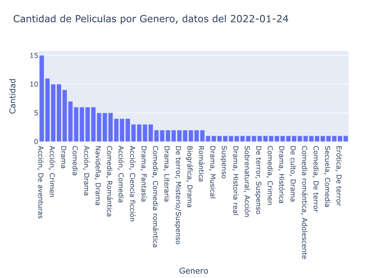
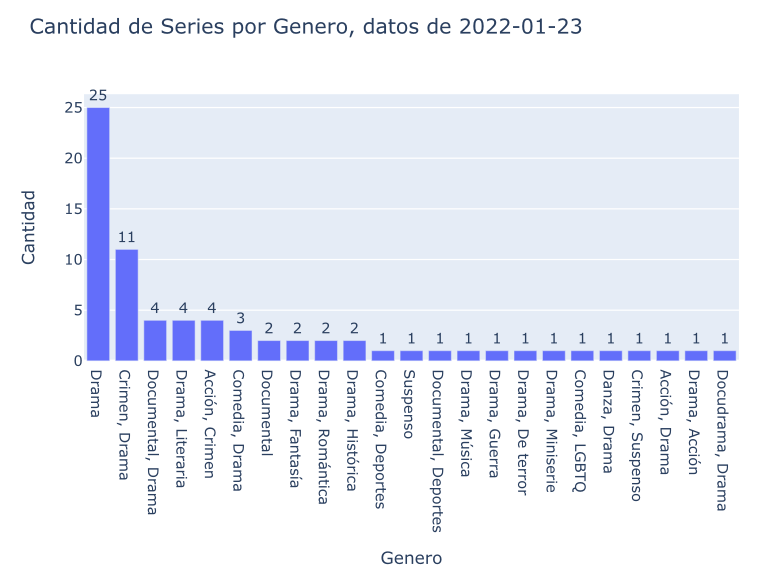
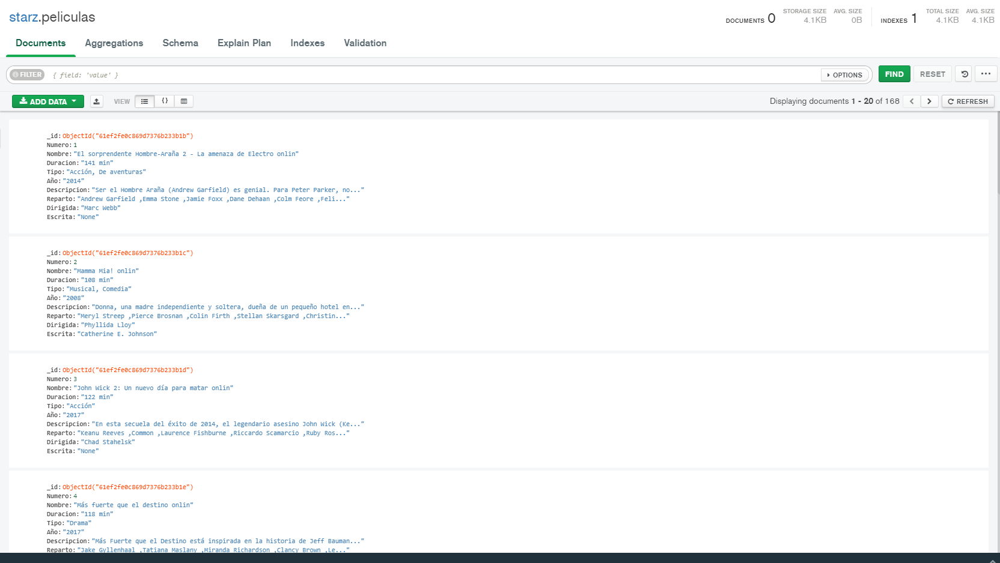
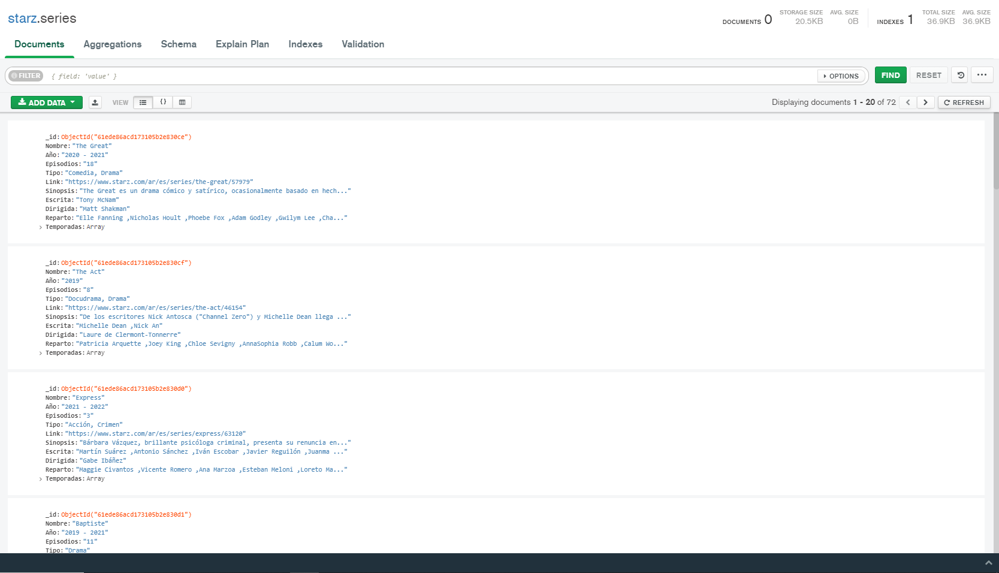

# Web Scraping starz

El siguiente trabajo consistió en hacer Web Scraping en la pagina de [starz](https://www.starz.com/ar), capturar todas las películas, todas las series con sus temporadas y capítulos y guardar los datos mas relevantes de cada uno en formato <b>.json</b> .

Una vez terminado el Web Scraping se guardan los archivos <b>.json</b> , se hace un grafico de barras para las peliculas y series para visualizar los generos de cada una y por ultimo se ejecuta un comando para insertar los datos a <b>MongoDB</b> .

# Librerias Utilizadas

<ui>

<li>
{BeautifoulSoup}
</li>

<li>
{Selenium}
</li>

<li>
{Pandas}
</li>

<li>
{Plotly}
</li>

</ui>

# Graficos de barras:

Películas:

Series:

# MongoDB:

Películas:

Series:

